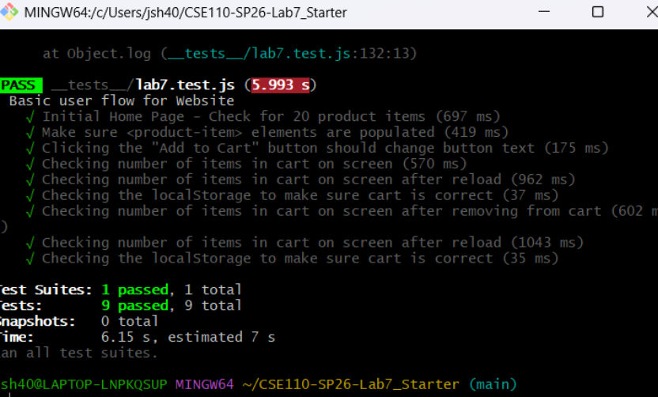

Soohwan Jeon

1. I would use automated tests in GitHub Actions because it automatically checks the code whenever we push changes.

2. No. End-to-end tests check if the website works correctly for users, not if one function returns the correct value.

3. Navigation mode checks the website when it first loads. Snapshot mode checks the website’s current state.

4. Three improvements:
- Better image descriptions 
- Better color contrast
- Faster loading / better performance

## Test Results

